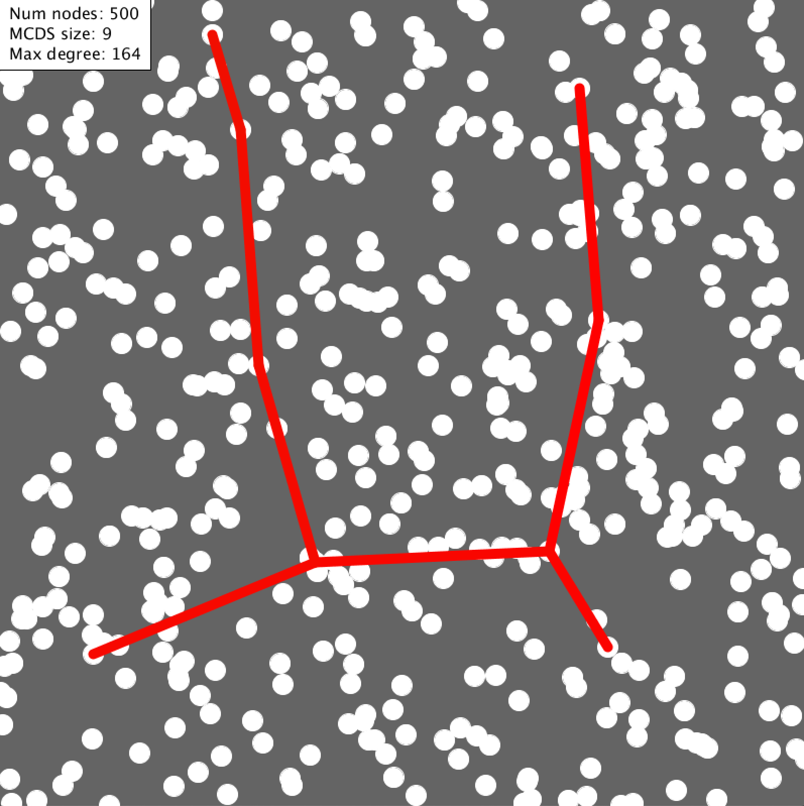
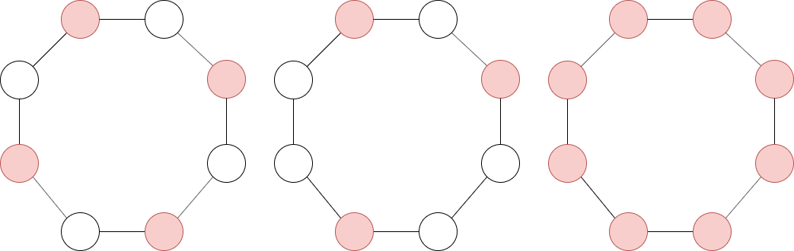
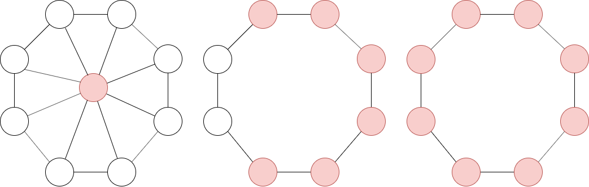
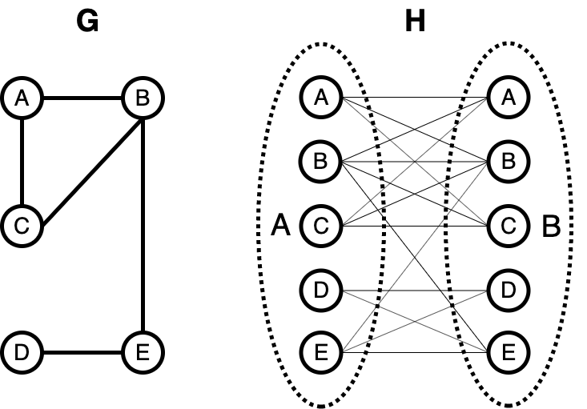
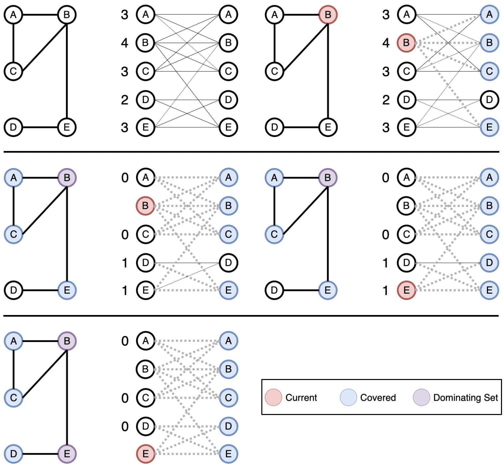

## Greedy Approximation of MCDS Visualization

### Overview

[Wireless ad hoc networks (WANETS)](https://en.wikipedia.org/wiki/Wireless_ad_hoc_network) rely on a decentralized, on demand, peer-to-peer network where each node on the network participates in the routing of messages. Usage of WANETs is becoming increasingly more popular with the rise of IoT and the growth of sensory networks.

Typically, nodes on a WANET have a limited range of transmission and therefore cannot directly communicate will all other nodes on the network. Nodes will instead rely on passing messages through a set of intermediary nodes, known as the "backbone", until a message reaches its desired recipient. The "backbone" should be reachable by all nodes on the network and will ideally be as small as possible to ensure efficient communication.

Identifying this "backbone" is an NP-complete problem known as the [Minimum Connected Dominating Set (MCDS)](https://en.wikipedia.org/wiki/Connected_dominating_set) problem.

__Problem Description__
Given a graph _G_ = ( _V_, _E_ ), a dominating set _D_ is a subset of _V_ such that all vertices of _V_ belong to _D_ or are adjacent to a vertex in _D_. In the image below, dominating sets are depicted over the three graphs as red nodes.

A connected dominating set is simply a dominating set _D_ which induces a connected subgraph of _G_. In the image below, connected dominating sets are depicted over the three graphs as red nodes.

The MCDS problem is to minimize the size of a connected dominating set of _G_.

__Greedy Solution__
Given a graph _G_ = ( _V_, _E_ ), let _H_ be a bipartite graph composed of two disjoint sets _A_, _B_ where _A_ and _B_ are both copies of _V_. Preserve all edges of _G_ in _H_ and assume each vertex is connected to itself.

Consider the number of neighbors for each node in _A_ and greedily choose the node with the highest degree. Add this node to our dominating set _D_. This covers all adjacent nodes in _B_ and we remove all incident edges of the covered nodes. Update the number of neighbors for each node in _A_ and repeat until all nodes in _B_ are covered. Note that for each subsequent iteration of the algorithm, we must choose the node with the highest degree which is also adjacent to some vertex in _D_.

### Requirements

In order to run this visualization tool, you will need to download and install [Processing](https://processing.org/download/). 

### Usage

Once Processing is installed, open any of the .pde files and run the program.

#### Controls

| Key | Description                             |
|-----|-----------------------------------------|
| 1-5   | set number of nodes {15, 75, 150, 300, 500} |
| n   | randomly generate new set of nodes |
| e   | toggle display of edges |
| r   | toggle display of ranges |
| m   | toggle display of MCDS |
| k   | toggle display of MCDS range |
| p   | toggle movement of nodes |

__Note:__ Implementation details are not yet optimized; program tick rate will deteriorate if displaying edges and ranges with large number of nodes.
